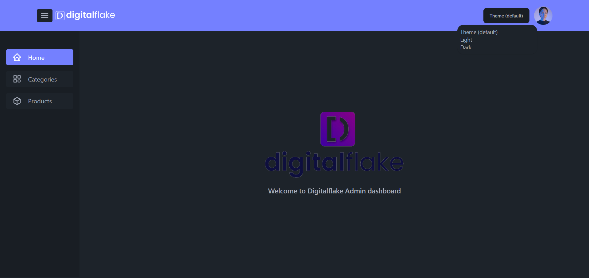

# Grocerie management ( DigitalFlake Assessment )

A web application built with Node.js, Express.js, TypeScript, React, Redux, and MongoDB. It provides a easy way to managing grocery items.

[](demo.mp4)

## Table of Contents

- [Installation](#installation)
- [Usage](#usage)

## Installation

Follow these steps:

1. Clone the repository:

```bash
git clone https://github.com/nabeel-ncz/grocery-management-tool.git
```

2. Navigate to the frontend directory and Install the dependencies

```bash
cd client/
```

```bash
npm install
```

3. Setup the environment variable

- Example given in the .env.local file

4. Build the frontend or run using

```bash
npm run dev
```

- Continue the same steps for backend

1. Navigate to the backend directory and Install the dependencies

```bash
cd server/
```

```bash
npm install
```

2. Setup the environment variable

- Example given in the .env.local file

3. Build the backend or run using

```bash
npm run dev
```


## Usage

- Once the installation is complete and the frontend and backend server is running, you can access the web application through your browser, using the link https://localhost:5173